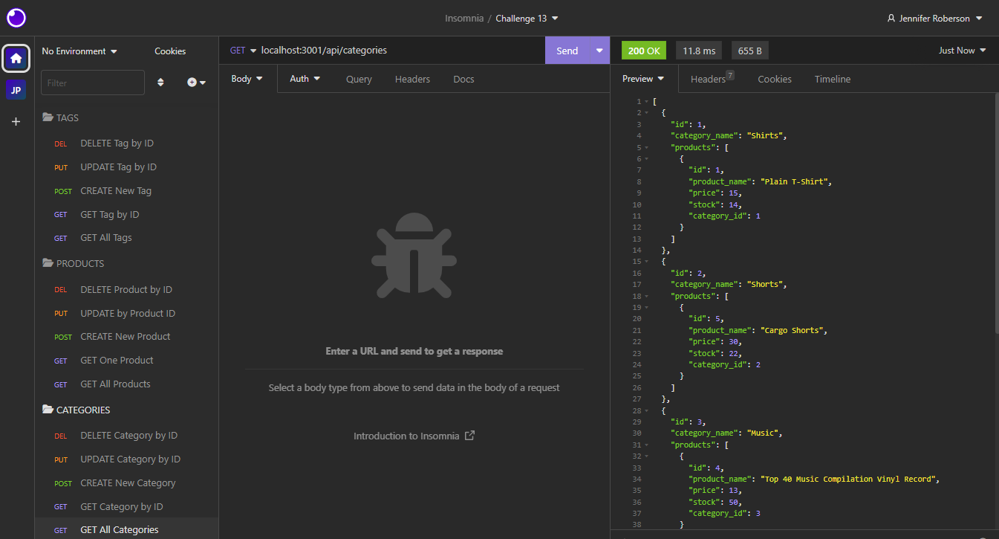

# Behind the Scenes of E-Commerce

## Description

This application builds a back end for an e-commerce site. It configures an Express.js API to use Seqelize to interact with a MySQL database. Insomnia is then used to test routes for CRUD functions.

## Installation Requirements

Dotenv, Express.js, MySQL2, Sequelize

## License

## Images

## Video Link

https://drive.google.com/file/d/1p8wKpYFk4wQNdU5sctEFdIsxO7MIhW0W/view